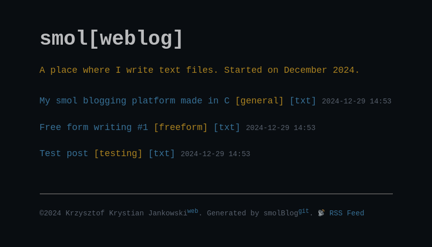

# smolBlog

A lightweight blogging platform and static site generator written in C.

## Features

- Simple and fast static page generation
- RSS feed
- No external dependencies
- Easy to customize



## Getting Started

### Prerequisites

- C compiler
- (optional) UPX

### Building

```bash
* gcc smolblog.c -o smolblog
* upx smolblog
```

### Usage

1. Create your posts in clear text format in the `working_dir/` directory
2. Run smolblog to listen for changes:
   ```bash
   ./smolblog
   ```
3. Copy ready to generate posts to /generate/
3. Your static site will be generated in the `output/` directory

## License

This project is open source under the MIT License.
